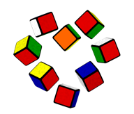

# [garron.net](https://garron.net/)

Lucas Garron's (new, new, new) personal website. Now with extra open-source and static flavor.

## Technology

This site uses a [custom static site generator](./SSG.md), because I was dissatisfied with all others I could find. After two decades without a good low-abstraction tool, I wrote something that:

- Is explicit rather than implicit.
  - No magic. All output is generated from explicit code in the source tree.
- Reuses existing technologies (e.g. DOM parsing and semantics) as much as possible.
- Uses composition over inheritance.
  - It should be easy to reuse templates but also simple to build a page with arbitrary contents and functionality.
- Allows writing performant pages.
  - In particular, it should be easy to inline critical code (e.g. CSS that avoids a flash of unstyled content) but also to reuse code.
